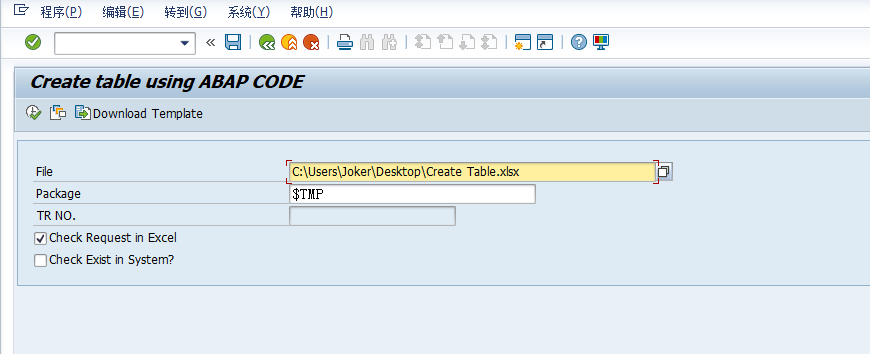
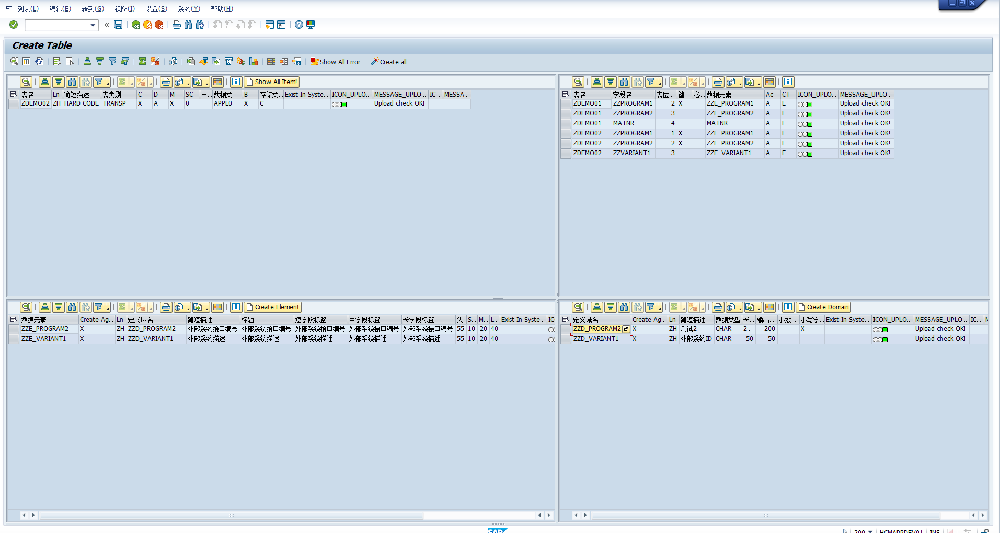

# 1.What can I do in this program?

If you want to create some tables、element or domain in your database, you can use this program to create them. 


# 2.How to use it?

## 2.1 using this command to clone the project to your local machine

First,You need to clone this program to your SAP system .

```bash
git clone https://github.com/linhuang0405/demo1.git
```

**Second**, you should modify the template file to meet your needs.

**Third**, you need to upload the template file to the SAP system.

**Finally**, you can run the program to create the tables、element or domain in your database.

**Note:** If you want to create the table in your database, you need to create the domain and element first.


**Select screen:**

**File:** the path of template file

**Package:** the package of the object,if you want to save as local object,please using '$TMP'

**TR NO:** the TR number of the object,if you choose the package isn't '$TMP',you can input the TR number that create in se09.

**Check Required in Excel:** when this is 'X'.It will check  the value of filed "Required or Not" in Template is 'X',the program will check the object is exist in the system or not.

**Check Exist in System:** will check if the object is exist in the system or not.（it will takes a long time to check object）



when you run the program, you can see the screen like this:



Tis: you can click the button "Show All Item" to show all the item in the template file.

you can click the button "Create all" to create the domain、element and table in order.

Also, you can click the button "Create Domain"、"Create Element"、"Create Table" to create the domain、element and table Single.

# 3.Text in Porgram

| Text number   | Description |
| ------------- | ------------- |
| E01| Path of File is Null!  |
| E02| Package can not be Null,if you want to save as local object,please using '$TMP'  |
| E03| TR NO. is request！   |
| E04| Error when general screen  |
| E05| Can't find fiele name in sheet of WOKSHEETNAME（Row 1）   |
| E06| Can't find ref table in sheet of WOKSHEETNAME（Row 4）   |
| E07| Can't find ref field in sheet of WOKSHEETNAME（Row 5）   |
| E08| Can't find KeyValue in sheet of WOKSHEETNAME（Row 6）   |
| E09| There are some error.Please check in " Show All Error"  |
| E10| Error in GOX_GEN_DOMA_STD  |
| E11| Error in DDIF_DOMA_GET  |
| E12| Error in DDIF_DOMA_ACTIVATE  |
| E13| Error in DDIF_DTEL_ACTIVATE  |
| E14| Error In GOX_GEN_TABLE_STD  |
| E15| Error In DDIF_TABL_PUT  |
| E16| Filed is empty:  |
| E17| Object In System ,If you want to create continue，please unsign the "Check Exist in System?" in select screen  |
| S01| Successfully！   |
| S04| Upload check OK!  |
| T01| Download Template  |
| T03| Create Table.xlsx  |
| T04| Create Again  |
| T06|                                                                                                                                       |
| T07| Creating Domain:  |
| T08| Creating Element:  |
| T09| Creating Table:  |
| T10| Show All Item!  |
| T11| Create Table  |
| T12| Create Element  |
| T13| Create Domain  |
| T20| Show All Item!  |
| T21| Create Table  |
| T22| Create Element  |
| T23| Create Domain  |
| T90| Upload Data is Running！   |
| T91| Upload finish！convert data running!  |
| T92| Sheet Name  |
| T93| Row  |
| T94| Error Message  |
| T95| Create Confirm!  |
| W01| Not Check After Upload!  |

